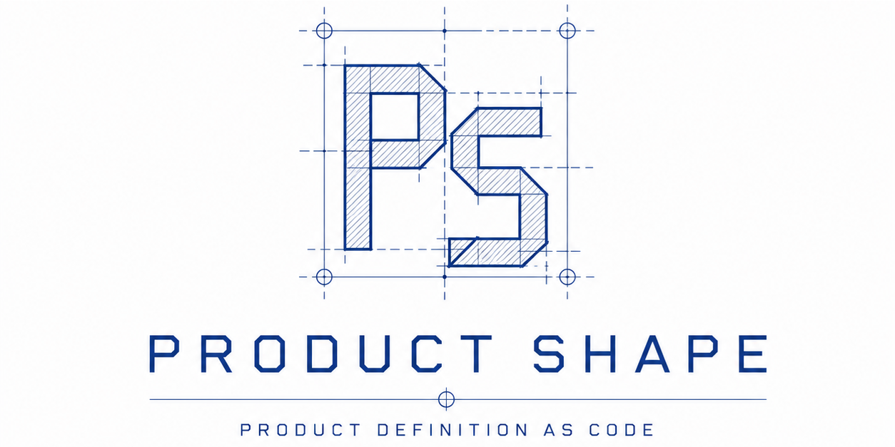

<p align="center">
  
</p>

<p align="center">
  <a href="https://github.com/juangcarmona/productshape/actions/workflows/ci.yml"></a>
  <a href="https://github.com/juangcarmona/productshape/actions/workflows/pdac-conformance.yml"></a>
  <a href="https://www.npmjs.com/package/@prodshape/cli"></a>
  <a href="LICENSE"></a>
</p>

# ProductShape

**ProductShape, the reference implementation of [Product Definition as Code](https://github.com/product-definition-as-code/spec).**

Product Definition as Code keeps the agreed product definition in versioned Markdown that delivery work cites instead of restating.

<p align="center">
  <a href="https://pdac.dev/#watch-the-drift"></a>
</p>

<p align="center"><em>Three specs restate one rule; a change flags every recorded citation. Real output — the end card names the CLI version recorded. <a href="https://pdac.dev/">Watch on pdac.dev</a>.</em></p>

<p align="center"><strong><a href="https://juangcarmona.github.io/productshape/">See a real product definition, live</a></strong> — this repository's own model, republished on every merge to <code>main</code>.</p>

The methodology belongs to the [specification repository](https://github.com/product-definition-as-code/spec): the normative contracts, the conformance tests and [the manifesto](https://github.com/product-definition-as-code/spec/blob/main/MANIFESTO.md), which states the founding position. ProductShape is the Product Definition as Code CLI: `prodshape` lets you author actors, journeys, use cases, business rules, domain terms and product requirements in Markdown, then keeps that definition validated, evolvable and citable:

- `prodshape init` — scaffold a product definition (and optional AI and OpenSpec integrations) in any repository.
- `prodshape validate` — validate the product definition deterministically: schemas, IDs, relationships and lifecycles, with stable diagnostic codes.
- `prodshape graph` and `prodshape impact <ID>` — compile the product graph from the Markdown and answer "what is connected to this?" structurally.
- `prodshape change validate` and `prodshape change apply` — evolve the definition through a Product Change: validated as an overlay, approved by a human, applied explicitly on a working branch. A human merge accepts the resulting baseline; apply is not acceptance.
- `prodshape cite` and `prodshape citations verify` — cite product artifacts from SDD specs and agent prompts by ID and content digest, then verify citations: `current`, `stale`, `tampered` or `unresolved`.

Deterministic tools check structure and references, never truth; people decide what is true and what should change.

## Install

Requires Node.js >= 22. The supported published baseline is **`@prodshape/cli@0.13.0`**.

```bash
npm install -g @prodshape/cli@0.13.0
# or run it once, without installing
pnpm dlx @prodshape/cli@0.13.0 --help
```

`prodshape` is the canonical binary; `product-definition` is an identical v0.x compatibility alias scheduled for removal before v1.

## Packages

The CLI bundles every package below, so installing `@prodshape/cli` is all you need. Each is also published separately for programmatic use, under the [`@prodshape`](https://www.npmjs.com/org/prodshape) scope, versioned independently with [Changesets](https://github.com/changesets/changesets) and published from GitHub Actions with provenance (see [RELEASING.md](RELEASING.md)).

| Package | Version | Description |
| --- | --- | --- |
| [`@prodshape/cli`](https://www.npmjs.com/package/@prodshape/cli) | [](https://www.npmjs.com/package/@prodshape/cli) | The `prodshape` command-line tool (bundles the rest) |
| [`@prodshape/core`](https://www.npmjs.com/package/@prodshape/core) | [](https://www.npmjs.com/package/@prodshape/core) | Deterministic parsing, validation and graph |
| [`@prodshape/distribution`](https://www.npmjs.com/package/@prodshape/distribution) | [](https://www.npmjs.com/package/@prodshape/distribution) | Init, provider-asset generation and doctor |
| [`@prodshape/integration-claude`](https://www.npmjs.com/package/@prodshape/integration-claude) | [](https://www.npmjs.com/package/@prodshape/integration-claude) | Claude Code renderer for canonical assets |
| [`@prodshape/integration-codex`](https://www.npmjs.com/package/@prodshape/integration-codex) | [](https://www.npmjs.com/package/@prodshape/integration-codex) | Codex renderer for canonical assets |
| [`@prodshape/integration-copilot`](https://www.npmjs.com/package/@prodshape/integration-copilot) | [](https://www.npmjs.com/package/@prodshape/integration-copilot) | GitHub Copilot renderer for canonical assets |
| [`@prodshape/integration-openspec`](https://www.npmjs.com/package/@prodshape/integration-openspec) | [](https://www.npmjs.com/package/@prodshape/integration-openspec) | OpenSpec configuration and citation-rule integration |

`@prodshape/integration-openspec` is the current OpenSpec package. The previously published `@prodshape/adapter-openspec` name belongs to older releases and is not part of the current package set.

## Quickstart

Your model, rendered, in a couple of minutes:

```bash
mkdir my-product && cd my-product
npm init -y && npm install --save-dev --save-exact @prodshape/cli@0.13.0
npx --no-install prodshape init

cat > docs/product/model/business-rules/br-refund-001.md <<'EOF'
---
id: BR-REFUND-001
type: business-rule
title: Refund window
status: active
---

## Rule

Refunds are accepted within 30 days of delivery.

## Rationale

Customers need a predictable window; finance needs a bounded liability.

## Examples

A delivery on March 1 may be refunded through March 31.

## Exceptions

None.
EOF

npx --no-install prodshape validate
npx --no-install prodshape graph --format html
open .product/generated/snapshot.html   # xdg-open on Linux
```

`validate` reports one warning — the rule has no consumers yet — which is the model telling you what to connect next. The snapshot is your product definition rendered as a browsable graph; add artifacts from `templates/` and re-run.

### Release contract (what CI executes)

One business rule, one citation, one detected drift. CI runs this exact block against the packed release candidate (the release-contract workflow), substituting only `PRODSHAPE_PACKAGE` with the tarball path — what you read here is what is tested.

<!-- release-contract-quickstart:start -->

```bash
set -eu
PRODSHAPE_PACKAGE="${PRODSHAPE_PACKAGE:-@prodshape/cli@0.13.0}"

mkdir productshape-quickstart
cd productshape-quickstart
npm init -y >/dev/null
npm install --save-dev --save-exact "$PRODSHAPE_PACKAGE"

npx --no-install prodshape init
npx --no-install prodshape validate

mkdir -p docs/product/model/business-rules openspec
cat > docs/product/model/business-rules/br-refund-001.md <<'EOF'
---
id: BR-REFUND-001
type: business-rule
title: Refund window
status: active
---

## Rule

Refunds are accepted within 30 days of delivery.

## Rationale

Customers need a predictable window; finance needs a bounded liability.

## Examples

A delivery on March 1 may be refunded through March 31.

## Exceptions

None.
EOF

npx --no-install prodshape cite \
  --id BR-REFUND-001 \
  --file docs/product/model/business-rules/br-refund-001.md \
  --form sidecar-ledger > openspec/refund.citations.yaml
npx --no-install prodshape citations verify

node --input-type=module -e "
  import { readFileSync, writeFileSync } from 'node:fs';
  const path = '.product/config.yaml';
  writeFileSync(path, readFileSync(path, 'utf8').replace('warnings-as-errors: false', 'warnings-as-errors: true'));
"
node --input-type=module -e "
  import { readFileSync, writeFileSync } from 'node:fs';
  const path = 'docs/product/model/business-rules/br-refund-001.md';
  writeFileSync(path, readFileSync(path, 'utf8').replace('30 days', '14 days'));
"

set +e
stale_output="$(npx --no-install prodshape citations verify 2>&1)"
stale_exit=$?
set -e
printf '%s\n' "$stale_output"
test "$stale_exit" -eq 1
printf '%s\n' "$stale_output" | grep -q 'PRODUCT061'
```

<!-- release-contract-quickstart:end -->

The first `prodshape citations verify` reports `current`. The second is expected to fail with `PRODUCT061` because the cited rule changed and this quickstart enables `warnings-as-errors` before the stale check: drift is detected instead of silent. Features on `main` newer than the pinned baseline are **unreleased** until a newer CLI version is published.

What to read next:

- [The methodology overview](docs/methodology/overview.md) — a five-minute read: the artifact families, the product graph, the operations and the citation contract.
- [The specification](https://github.com/product-definition-as-code/spec) — normative — and [its manifesto](https://github.com/product-definition-as-code/spec/blob/main/MANIFESTO.md), the authoritative founding position. The [frontmatter reference](docs/specification/frontmatter-reference.md) enumerates what you may write in every artifact kind; `prodshape schema <kind>` prints the same contract without a repository.
- The self-hosted model under [`docs/product/model`](docs/product/model): this repository defines itself with its own methodology, so every artifact kind has a real example. `schemas/` and `templates/` hold the machine contracts the CLI validates against and a conformant starting point for each kind.
- Adoption guides for the four entry paths: [greenfield](docs/adoption/greenfield.md), [brownfield](docs/adoption/brownfield.md), [existing repository](docs/adoption/existing-repository.md) and [existing OpenSpec repository](docs/adoption/existing-openspec-repository.md).

## Agent skills

`prodshape init --ai claude,codex,copilot` installs generated commands and skills for the chosen providers, so an AI agent works the model through the same operations you do: explore, define, change, audit, impact and recover. The assets are canonical to the CLI — `prodshape integration update` refreshes them after an upgrade — and [the methodology overview](docs/methodology/overview.md) explains what each operation does.

## PDaC conformance

The pinned conformance workflow builds and packs ProductShape, installs that tarball outside the workspace, and runs the spec's conformance tests via the external runner `pdac-lint` (`0.1.2`) against [PDaC spec commit `89b43b78a6547c9dea709b6d261212c2fe4f3c4b`](https://github.com/product-definition-as-code/spec/commit/89b43b78a6547c9dea709b6d261212c2fe4f3c4b) — the full published v0.1-draft profile: kernel, reference profile and reference workflow. The published tests are not yet a complete normative set, so the badge claims only this pinned executable profile; ProductShape's own fixtures, self-model and traceability checks run separately as **Internal contracts**.

## Current status

`@prodshape/cli@0.13.0` is the supported published baseline. It includes deterministic brownfield recovery sessions, Product Change overlay validation and apply with the affected-citation report, citation emission and verification (including provider-aware OpenSpec population verification), snapshot generation, schema discovery, filename repair, SDD-aware initialization, `prodshape change create`, `prodshape drift`, `prodshape --version`, and generated AI/OpenSpec integrations. The [root changelog](CHANGELOG.md) records every stable CLI release; version `0.10.0` was prepared but never published, and its changes shipped in `0.11.0`.

Remaining open decisions are in [OPEN-DECISIONS.md](OPEN-DECISIONS.md). Deliberately out of scope, among others: graph databases, web UIs, MCP servers, Jira integration, multi-repository graphs, automatic brownfield recovery, roadmaps and OKRs, hosted services and telemetry — the full list, plus known design limitations, is in [Limitations](docs/limitations.md).

## Contributing

See [CONTRIBUTING.md](CONTRIBUTING.md). The specification is normative, `docs/product` is canonical, and changes to the product definition itself go through its own Change operation.
